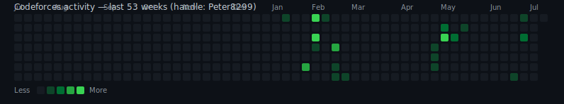

# CodeForces-Solutions 🧩

> I code here.

Solutions to problems solved on [Codeforces](https://codeforces.com), organized by topic. Written in C, C++, and Python depending on the problem and mood.

<p align="left">
  
  
  
</p>

**Handle:** [Peter8299](https://codeforces.com/profile/Peter8299)

---

## 🎯 Purpose of this Repo

This repository is where I track my competitive programming journey on Codeforces. It contains my solutions to problems I've solved, organized by topic, as a way to:

- Keep a personal record of problems solved and techniques learned
- Revisit and review past approaches when tackling similar problems later
- Track rating progress and growth over time
- Share solutions with anyone else practicing the same problems

This is not a tutorial repo — solutions reflect my own thought process and may not always be the most optimal, but they're the ones that got Accepted.

---

## 📊 Stats

<p align="center">
  
</p>

### 🔥 Activity Heatmap

<p align="center">
  
</p>

*Auto-generated daily from my Codeforces submissions — see [Auto-Updating](#-auto-updating) below.*

---

## 📁 Repository Structure

Each solved problem gets its own folder, named with the problem's code and title. Inside, the solution file is named after the problem code (`.py` or `.cpp` depending on the language used).

```
CodeForces-Solutions/
├── 4A - Watermelon/
│   └── 4A.cpp
├── 158A - Next Round/
│   └── 158A.cpp
├── 2241C - RemovevomeR/
│   └── 2241C.py
└── ...
```

---

## ✅ Problems Solved

<!-- PROBLEMS-TABLE:START -->
| # | Problem | Solution |
|---|---------|----------|
| 1 | [2246A - farmpiggie and Subset Sum](https://codeforces.com/problemset/problem/2246/A) | [Link](./2246A%20-%20farmpiggie%20and%20Subset%20Sum/) |
| 2 | [2241C - RemovevomeR](https://codeforces.com/problemset/problem/2241/C) | [Link](./2241C%20-%20RemovevomeR/) |
| 3 | [2241A - Divide and Conquer](https://codeforces.com/problemset/problem/2241/A) | [Link](./2241A%20-%20Divide%20and%20Conquer/) |
| 4 | [1328A - Divisibility Problem](https://codeforces.com/problemset/problem/1328/A) | [Link](./1328A%20-%20Divisibility%20Problem/) |
| 5 | [2238B - Crimson Triples](https://codeforces.com/problemset/problem/2238/B) | [Link](./2238B%20-%20Crimson%20Triples/) |
| 6 | [2238A - Another Puzzle from Papyrus](https://codeforces.com/problemset/problem/2238/A) | [Link](./2238A%20-%20Another%20Puzzle%20from%20Papyrus/) |
| 7 | [2240B - AI Finds Nothing Here](https://codeforces.com/problemset/problem/2240/B) | [Link](./2240B%20-%20AI%20Finds%20Nothing%20Here/) |
| 8 | [2240A - Another Popcount Problem](https://codeforces.com/problemset/problem/2240/A) | [Link](./2240A%20-%20Another%20Popcount%20Problem/) |
| 9 | [2230A - Optimal Purchase](https://codeforces.com/problemset/problem/2230/A) | [Link](./2230A%20-%20Optimal%20Purchase/) |
| 10 | [61A - Ultra-Fast Mathematician](https://codeforces.com/problemset/problem/61/A) | [Link](./61A%20-%20Ultra-Fast%20Mathematician/) |
| 11 | [228A - Is your horseshoe on the other hoof?](https://codeforces.com/problemset/problem/228/A) | [Link](./228A%20-%20Is%20your%20horseshoe%20on%20the%20other%20hoof?/) |
| 12 | [136A - Presents](https://codeforces.com/problemset/problem/136/A) | [Link](./136A%20-%20Presents/) |
| 13 | [344A - Magnets](https://codeforces.com/problemset/problem/344/A) | [Link](./344A%20-%20Magnets/) |
| 14 | [486A - Calculating Function](https://codeforces.com/problemset/problem/486/A) | [Link](./486A%20-%20Calculating%20Function/) |
| 15 | [467A - George and Accommodation](https://codeforces.com/problemset/problem/467/A) | [Link](./467A%20-%20George%20and%20Accommodation/) |
| 16 | [1030A - In Search of an Easy Problem](https://codeforces.com/problemset/problem/1030/A) | [Link](./1030A%20-%20In%20Search%20of%20an%20Easy%20Problem/) |
| 17 | [116A - Tram](https://codeforces.com/problemset/problem/116/A) | [Link](./116A%20-%20Tram/) |
| 18 | [271A - Beautiful Year](https://codeforces.com/problemset/problem/271/A) | [Link](./271A%20-%20Beautiful%20Year/) |
| 19 | [677A - Vanya and Fence](https://codeforces.com/problemset/problem/677/A) | [Link](./677A%20-%20Vanya%20and%20Fence/) |
| 20 | [118A - String Task](https://codeforces.com/problemset/problem/118/A) | [Link](./118A%20-%20String%20Task/) |
| 21 | [1A - Theatre Square](https://codeforces.com/problemset/problem/1/A) | [Link](./1A%20-%20Theatre%20Square/) |
| 22 | [318A - Even Odds](https://codeforces.com/problemset/problem/318/A) | [Link](./318A%20-%20Even%20Odds/) |
| 23 | [41A - Translation](https://codeforces.com/problemset/problem/41/A) | [Link](./41A%20-%20Translation/) |
| 24 | [734A - Anton and Danik](https://codeforces.com/problemset/problem/734/A) | [Link](./734A%20-%20Anton%20and%20Danik/) |
| 25 | [2227B - Party Monster](https://codeforces.com/problemset/problem/2227/B) | [Link](./2227B%20-%20Party%20Monster/) |
| 26 | [2227A - Koshary](https://codeforces.com/problemset/problem/2227/A) | [Link](./2227A%20-%20Koshary/) |
| 27 | [200B - Drinks](https://codeforces.com/problemset/problem/200/B) | [Link](./200B%20-%20Drinks/) |
| 28 | [110A - Nearly Lucky Number](https://codeforces.com/problemset/problem/110/A) | [Link](./110A%20-%20Nearly%20Lucky%20Number/) |
| 29 | [977A - Wrong Subtraction](https://codeforces.com/problemset/problem/977/A) | [Link](./977A%20-%20Wrong%20Subtraction/) |
| 30 | [59A - Word](https://codeforces.com/problemset/problem/59/A) | [Link](./59A%20-%20Word/) |
| 31 | [546A - Soldier and Bananas](https://codeforces.com/problemset/problem/546/A) | [Link](./546A%20-%20Soldier%20and%20Bananas/) |
| 32 | [266A - Stones on the Table](https://codeforces.com/problemset/problem/266/A) | [Link](./266A%20-%20Stones%20on%20the%20Table/) |
| 33 | [617A - Elephant](https://codeforces.com/problemset/problem/617/A) | [Link](./617A%20-%20Elephant/) |
| 34 | [791A - Bear and Big Brother](https://codeforces.com/problemset/problem/791/A) | [Link](./791A%20-%20Bear%20and%20Big%20Brother/) |
| 35 | [158A - Next Round](https://codeforces.com/problemset/problem/158/A) | [Link](./158A%20-%20Next%20Round/) |
| 36 | [281A - Word Capitalization](https://codeforces.com/problemset/problem/281/A) | [Link](./281A%20-%20Word%20Capitalization/) |
| 37 | [339A - Helpful Maths](https://codeforces.com/problemset/problem/339/A) | [Link](./339A%20-%20Helpful%20Maths/) |
| 38 | [236A - Boy or Girl](https://codeforces.com/problemset/problem/236/A) | [Link](./236A%20-%20Boy%20or%20Girl/) |
| 39 | [112A - Petya and Strings](https://codeforces.com/problemset/problem/112/A) | [Link](./112A%20-%20Petya%20and%20Strings/) |
| 40 | [263A - Beautiful Matrix](https://codeforces.com/problemset/problem/263/A) | [Link](./263A%20-%20Beautiful%20Matrix/) |
| 41 | [50A - Domino piling](https://codeforces.com/problemset/problem/50/A) | [Link](./50A%20-%20Domino%20piling/) |
| 42 | [282A - Bit++](https://codeforces.com/problemset/problem/282/A) | [Link](./282A%20-%20Bit++/) |
| 43 | [231A - Team](https://codeforces.com/problemset/problem/231/A) | [Link](./231A%20-%20Team/) |
| 44 | [71A - Way Too Long Words](https://codeforces.com/problemset/problem/71/A) | [Link](./71A%20-%20Way%20Too%20Long%20Words/) |
| 45 | [4A - Watermelon](https://codeforces.com/problemset/problem/4/A) | [Link](./4A%20-%20Watermelon/) |
<!-- PROBLEMS-TABLE:END -->

---

## 🛠️ Languages Used


---

## 📈 Progress Log

- Total problems solved (all time): 50+
- Solved in the last month: 7

---

## 🤖 Auto-Updating

This README updates itself. A [GitHub Actions workflow](./.github/workflows/update-readme.yml) runs daily (and can be triggered manually from the **Actions** tab), which:

1. Calls the Codeforces API for my submission history
2. Regenerates the **Problems Solved** table above with any newly solved problems
3. Regenerates the **activity heatmap** SVG in `assets/heatmap.svg`
4. Commits the changes back to this repo automatically

No manual editing needed to keep stats current — see [`scripts/update_readme.py`](./scripts/update_readme.py) for the update logic.

---

⭐ If you find any of this useful, a star is appreciated!
